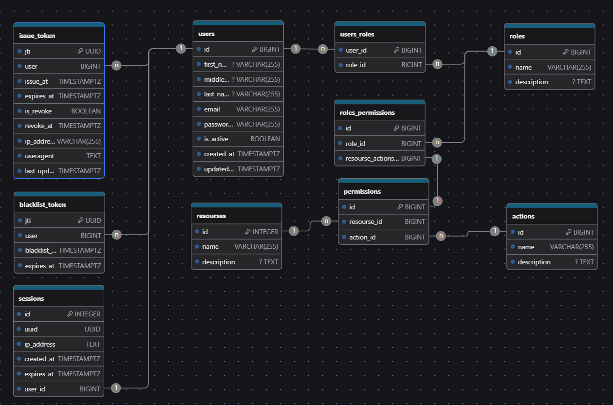
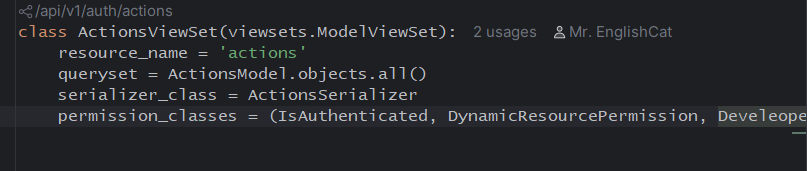

# Система аутентификации и авторизации

Собственная система аутентификации и авторизации с JWT-токенами, управлением сессиями и гибкой системой прав доступа.

PS может быть будет развиваться дальше)

PPS:
 - В БД SqLite - есть данные.(все таблицы кроме сессий)
 - создавал тестовую учетную запись: 
   - **login**: mr.englishcat@gmail.com
   - **password**: root
   - **password2**: root
 - Каталог ```for db``` в нем есть список ```INSERT```-ов что бы наполнить базу данных.
 - Так же что бы использовать тестовую БД SqLite - нужно в файле ```settings.py``` раскоментировать переменную ```DATABASE``` для sqlite и закомментировать такующе переменную для PostgreSQL.
 - **Тестовые ресурсы** - это сами API - у каждого API есть свой resource_name - за счет которого проверяются права доступа.


## 📋 Описание проекта

Проект представляет собой полноценную систему управления пользователями с:

- **JWT-аутентификацией** (access + refresh токены)
- **Управлением сессиями** (активные сессии, отзыв токенов) (оставил только токены, но начал добавление сессий, есть несколько методов)
- **Гибкой системой прав доступа** (RBAC), 
- **Защитой от брутфорса** (rate limiting) - в планах все таки добавить, интересная штука
- **Мгновенным разлогиниванием** при деактивации пользователя
- **RESTful API** с документацией Swagger(есть еще redoc) (на данный момент описания не полные. В планах доработать)

# API Endpoints — Authentication & Authorization Module

Данный модуль предоставляет REST API для управления пользователями, ролями, действиями, сессиями и аутентификацией в системе. Используется Django REST Framework с маршрутизацией через `DefaultRouter`.

---

## 📁 Основные маршруты (через `DefaultRouter`)

Все основные эндпоинты доступны по префиксу `/` и включают:

| Эндпоинт             | ViewSet / Класс              | Базовое имя (`basename`) | Описание                     |
|----------------------|------------------------------|--------------------------|------------------------------|
| `/users/`            | `CustomUserAPIView`          | `user`                   | CRUD операции с пользователями |
| `/roles/`            | `RolesAPIView`               | `role`                   | Управление ролями            |
| `/actions/`          | `ActionsViewSet`             | `action`                 | Управление действиями        |
| `/resourses/`        | `ResoursesAPIView`           | `resourse`               | Управление ресурсами         |
| `/session/`          | `SessionsViewSet`            | `session`                | Управление сессиями          |

> Все маршруты поддерживают стандартные HTTP-методы: `GET`, `POST`, `PUT`, `PATCH`, `DELETE` (в зависимости от реализации ViewSet).

---

## 🔐 Аутентификация и управление токенами

| Эндпоинт                     | View                          | Описание                                      |
|------------------------------|-------------------------------|-----------------------------------------------|
| `POST /login/`               | `LoginAPIView`                | Авторизация пользователя и выдача токенов     |
| `POST /logout/`              | `LogoutAPIView`               | Выход из системы (отзыв текущего токена)      |
| `POST /register/`            | `RegisterAPIView`             | Регистрация нового пользователя               |
| `POST /token/refresh/`       | `RefreshTokenAPIView`         | Обновление access-токена по refresh-токену    |
| `POST /token/revoke/`        | `TokenRevokeAPIView`          | Отзыв текущего refresh-токена                 |
| `POST /token/revoke_all/`    | `TokenRevokeALLAPIView`       | Отзыв всех refresh-токенов текущего пользователя |
| `POST /token/revoke_all/<int:user_id>/` | `AdminTokenRevokeALLAPIView` | Административный отзыв всех токенов указанного пользователя |

---

## 👤 Профиль и сессии пользователя

| Эндпоинт                         | View                      | Описание                                      |
|----------------------------------|---------------------------|-----------------------------------------------|
| `GET /me/`                       | `MyProfileAPIView`        | Получение профиля текущего пользователя       |
| `GET /me/get_sessions/`          | `MySessionsAPIView`       | Получение списка активных сессий (refresh-токенов) текущего пользователя |
| `GET /me/get_sessions/<int:user_id>` | `AdminSessionsAPIView`    | Административный просмотр сессий указанного пользователя |

---

## ⚠️ Примечания

- Эндпоинт `token/revoke/<int:user_id>/` временно отключен (закомментирован), так как не найдено практического применения =(.
- Все административные эндпоинты (с `<int:user_id>`) требуют соответствующих прав доступа.
- Для корректной работы необходимо наличие JWT-токенов (access и refresh) в заголовках запросов (`Authorization: Bearer <token>`).

---

## 🛠️ Технические зависимости

- Django REST Framework
- `routers.DefaultRouter` для автоматической маршрутизации ViewSet
- JWT-аутентификация (предполагается использование `djangorestframework-simplejwt` или аналога, но используется модуль jwt)

---


## 🏗️ Архитектура
```aiignore
auth_app/
├── models/ # Модели данных
├── serializers/ # Сериализаторы DRF
├── views/ # View-классы API
├── authentication.py # JWT-аутентификация
├── permissions/ # Пользовательские разрешения
├── signals.py # Сигналы Django
├── utils/ # Вспомогательные функции
└── urls.py # Маршруты API
```


## 🗃️ Структура базы данных


### 1. Пользователи

#### `auth_app_customusermodel`
Основная модель пользователя

| Поле | Тип                 | Описание                             |
|------|---------------------|--------------------------------------|
| id | BIGINT (PK)         | Уникальный идентификатор             |
| email | VARCHAR(150) UNIQUE | Email пользователя                   |
| password | VARCHAR(128)        | Хэш пароля                           |
| first_name | VARCHAR(150)        | Имя                                  |
| last_name | VARCHAR(150)        | Фамилия                              |
| middle_name | VARCHAR(150) NULL   | Отчество                             |
| is_active | BOOLEAN             | Активен ли аккаунт                   |
| is_staff | BOOLEAN             | Может ли входить в админку           |
| is_superuser | BOOLEAN             | Суперпользователь                    |
| date_joined | DATETIME            | Дата регистрации                     |
| last_login | DATETIME NULL       | Последний вход                       |
| updated_at | DATETIME            | Дата обновления профиля              |
| force_logout_at | DATETIME NULL       | Дата принудительного разлогинивания - в планах добавить | 

**Особенности:**
- Пользователь может одновременно находиться в различных группах (иметь разные роли в таблице `auth_app_rolesmodel`)


### 2. Токены

#### `auth_app_issuetokenmodel`
Выданные токены (refresh)

| Поле         | Тип | Описание |
|--------------|-----|----------|
| jti          | UUID UNIQUE | Уникальный ID токена |
| user_id      | BIGINT (FK) | Ссылка на пользователя |
| issued_at    | DATETIME | Дата выдачи |
| expires_at   | DATETIME | Дата истечения |
| is_revoked   | BOOLEAN | Отозван ли токен |
| revoked_at   | DATETIME NULL | Дата отзыва |
| ip_address   | INET NULL | IP-адрес выдачи |
| user_agent   | TEXT | User-Agent клиента |
| last_used_at | DATETIME NULL | Последнее использование |

**Особенности:**
- Используется так же для прохождения авторизации(через слой JWTAuthorization). Т е в заголовке его можно передавать вместо access токена. **Не рекомендуется**.
- 


#### `auth_app_blacklisttoken`
Отозванные токены(refresh)

| Поле | Тип | Описание |
|------|-----|----------|
| id | BIGINT (PK) | Уникальный идентификатор |
| jti | UUID | Уникальный ID токена |
| user_id | BIGINT (FK) | Ссылка на пользователя |
| blacklist_at | DATETIME | Дата добавления в черный список |
| expires_at | DATETIME | Дата истечения токена |


### 3. Расширенная система прав доступа (RBAC)

#### `auth_app_rolesmodel`
Роли пользователей

| Поле | Тип | Описание |
|------|-----|----------|
| id | BIGINT (PK) | Уникальный идентификатор |
| name | VARCHAR(100) UNIQUE | Название роли |
| code_name | VARCHAR(100) UNIQUE | Кодовое имя роли |
| description | TEXT NULL | Описание роли |
| permissions | ManyToMany(PermissionsModel) | Связь с разрешениями |

**Особенности:**
- Каждая роль имеет уникальное `name` и `code_name`
- `code_name` используется для программной идентификации ролей - должен совпадать с атрибутом класса из views/ .resource_name. Пишется на латинице. Заполняется разработчиком. Доступ имеет только пользователь со статусом supervisor(is_supervisor=True). По мере добавления новых ресурсов, так же заполняется данная таблица.
- Роли могут иметь множество разрешений через промежуточную таблицу `auth_app_permissionsmodel`

#### `auth_app_permissionsmodel`
Разрешения (связь ресурсов и действий)

| Поле | Тип | Описание |
|------|-----|----------|
| id | BIGINT (PK) | Уникальный идентификатор |
| resource | BIGINT (FK) | Ссылка на ресурс |
| action | BIGINT (FK) | Ссылка на действие |

**Особенности:**
- Уникальная связь между ресурсом и действием
- Представляет конкретное разрешение (например, "чтение пользователей")
- Используется для связи ролей и разрешений
- На один ресурс можно применить множество действий.
- Так же одно действие может относиться ко множеству ресурсов.

#### `auth_app_resourcesmodel`
Ресурсы системы (данная таблица заполняется либо разработчиком, либо пользователем со статусом is_supervisor по данным от разработчика)
**Поле `code_name` ** должно соответствовать названию в атрибуте resource_name классов из каталога views/

Пример: 


Если у класса контроллера указано `resource_name = 'actions'` то такое же кодовое имя `code_name` должно быть указано в таблице

| Поле | Тип | Описание |
|------|-----|----------|
| id | BIGINT (PK) | Уникальный идентификатор |
| name | VARCHAR(100) UNIQUE | Название ресурса |
| code_name | VARCHAR(100) UNIQUE | Кодовое имя ресурса |
| description | TEXT NULL | Описание ресурса |

**Примеры ресурсов(`code_name`):**
- `users` - Управление пользователями
- `roles` - Управление ролями
- `projects` - Управление проектами
- `documents` - Работа с документами

#### `auth_app_actionsmodel`
Действия над ресурсами (на текущий момент асоциация идет с типами HTTP запросов)

```python
#...
class RequestMethods(Enum):
    # ['read', 'update', 'all', 'delete', 'create']
    GET = 'read'
    POST = 'create'
    PUT = 'update'
    PATCH = 'update'
    DELETE = 'delete'
    ALL = 'all'

#...
# Алгоритм проверки прав, сопоставляет метод запроса со значением в классе Enum. Сейчас доступны только варианты
# ['read', 'update', 'all', 'delete', 'create']
if actions:
    view.actions = list(actions)
    if 'all' in view.actions:
        return True
    request_methods = {
        RequestMethods.GET.name: RequestMethods.GET.value,
        RequestMethods.POST.name: RequestMethods.POST.value,
        RequestMethods.PUT.name: RequestMethods.PUT.value,
        RequestMethods.PATCH.name: RequestMethods.PATCH.value,
        RequestMethods.DELETE.name: RequestMethods.DELETE.value,
    }

    if request_methods.get(request.method, False) in view.actions:
        return True
return False
```

| Поле | Тип | Описание |
|------|-----|----------|
| id | BIGINT (PK) | Уникальный идентификатор |
| name | VARCHAR(100) UNIQUE | Название действия |
| description | TEXT NULL | Описание действия |
| code_name | VARCHAR(100) UNIQUE | Кодовое имя действия |

**Примеры действий:**
- `read` - Просмотр
- `create` - Создание
- `update` - Обновление
- `delete` - Удаление
- `approve` - Подтверждение
- `export` - Экспорт


**Особенности:**
- Связь с ресурсами через ManyToMany через промежуточную таблицу `PermissionsModel`
- `code_name` используется в коде для определения типа действия

### 5. Управление сессиями

#### `auth_app_sessionsmodel`
Активные сессии пользователей (в стадии разработки)

| Поле | Тип | Описание |
|------|-----|----------|
| id | BIGINT (PK) | Уникальный идентификатор |
| uuid | UUID UNIQUE | Уникальный ID сессии |
| ip_address | INET | IP-адрес пользователя |
| user_agent | TEXT | User-Agent клиента |
| created_at | DATETIME | Дата создания сессии |
| expires_at | DATETIME | Дата истечения сессии |
| is_active | BOOLEAN | Активна ли сессия |
| user_id | BIGINT (FK) | Ссылка на пользователя |

**Особенности:**
- Каждая сессия имеет уникальный UUID для идентификации
- Хранит метаданные сессии (IP, User-Agent)
- Позволяет управлять активными сессиями пользователя(на данный момент через is_active. В дальнейшем хотел сессию закрепить за refresh токеном)
- Поддерживает отзыв сессий (через `is_active = False`)
- Автоматическое истечение через 24 часа ( в разработке)


## 🎯 Примеры использования

### 1. Создание роли с разрешениями:
```python
# Создание ресурсов и действий
users_resource = ResourcesModel.objects.create(
    name="Пользователи",
    code_name="users",
    description="Управление пользователями"
)

read_action = ActionsModel.objects.create(
    name="Просмотр",
    code_name="read",
    description="Просмотр ресурсов"
)

# Создание разрешения
permission = PermissionsModel.objects.create(
    resource=users_resource,
    action=read_action
)

# Создание роли
admin_role = RolesModel.objects.create(
    name="Администратор",
    code_name="admin",
    description="Полный доступ к системе"
)

# Назначение разрешения роли
admin_role.permissions.add(permission)
```


## 🔐 Механизм аутентификации

### 1. Регистрация пользователя

#### Процесс регистрации:

``` http request
POST /api/auth/register/
{
    "email": "user@example.com ",  # is required
    "password": "strongpassword123",  # is required
    "password2": "strongpassword123",  # is required
    "first_name": "Иван",
    "last_name": "Иванов"
}
```


**Этапы:**
1. **Валидация данных** - проверка email, сложности пароля, совпадения паролей
2. **Проверка уникальности** - убедиться, что email не занят
3. **Хэширование пароля** - безопасное хранение через `make_password()`
4. **Создание пользователя** - запись в `CustomUserModel`
5. **Генерация токенов** - создание пары access/refresh JWT
6. **Создание сессии** - запись в `SessionsModel` (в разработке, создает запись пока что при аутентификации))
7. **Отправка ответа** - возврат токенов и данных пользователя

**Ответ:**
```python
{
  "access": "eyJhbGciOiJIUzI1NiIsInR5cCI6IkpXVCJ9...",
  "refresh": "eyJhbGciOiJIUzI1NiIsInR5cCI6IkpXVCJ9...",
  "user": {  # это поле есть в новой ветке
    "id": 1,
    "email": "user@example.com",
    "first_name": "Иван",
    "last_name": "Иванов"
  }
}
```


📌 *Документация актуальна на момент последнего обновления кода.*

