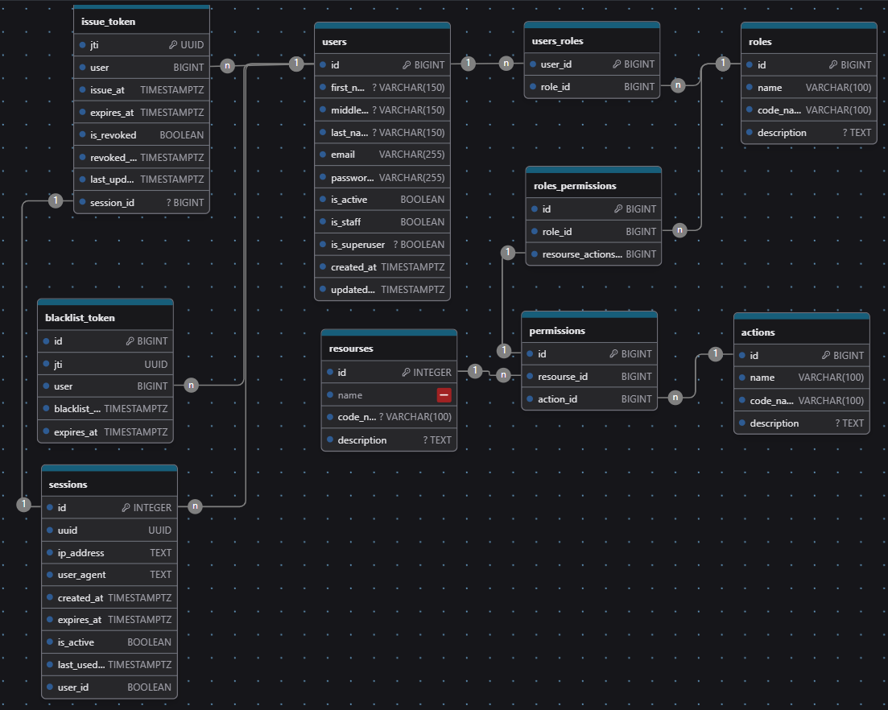

# Система аутентификации и авторизации

Собственная система аутентификации и авторизации с JWT-токенами, управлением сессиями и гибкой системой прав доступа.

PS может быть будет развиваться дальше)

PPS:

- В БД SqLite - есть данные.(все таблицы кроме сессий)
- Перед наполнением БД нужно сделать миграции(для исполнения путь терминала должен быть в корне проекта, где находится
  файл ```manage.py```):
   ```python
  python manage.py makemigrations  # создание миграций
  
  python manage.py migrate  # запуск миграций
  
  python manage.py runserver  # запуск тестового сервера
  ```
- Каталог ```for db``` в нем есть список ```INSERT```-ов что бы наполнить базу данных (файлы).
    - команды запускаются в порядке названия каталогов:
        - firts
        - second
        - third
- Так же что бы использовать тестовую БД SqLite - нужно в файле ```settings.py``` раскоментировать переменную
  ```DATABASE``` для sqlite и закомментировать такующе переменную для PostgreSQL.
- **Тестовые ресурсы** - это сами API - у каждого API есть свой resource_name - за счет которого проверяются права
  доступа. ()
- создавал тестовую учетную запись:
    - **login**: mr.englishcat@gmail.com
    - **password**: root
    - **password2**: root

## 📋 Описание проекта

Проект представляет собой полноценную систему управления пользователями с:

- **JWT-аутентификацией** (access + refresh токены)
- **Управлением сессиями** (активные сессии, отзыв токенов) (оставил только токены, но начал добавление сессий, есть
  несколько методов)
- **Гибкой системой прав доступа** (RBAC),
- **Защитой от брутфорса** (rate limiting) - в планах все таки добавить, интересная штука
- **Мгновенным разлогиниванием** при деактивации пользователя  (перевести на сессии)
- **RESTful API** с документацией Swagger(есть еще redoc) (на данный момент описания не полные. В планах доработать)

>[!NOTE]
> Файл ```.env``` нужен для загрузки в переменные окружения секретов. Если файла нету, то используются указанные в коде. Ниже приведена ПРИМЕРНАЯ структура .env файла. Значения переменных заполняются вашими значениями.
> ```dotenv структура .env файла
> SECRET_KEY="django-insecure-4*z$6=02i=k9i@c$9mzy7k@ac_3e6=vp!-b0hn5b22p9z!8#jg"
> JWT_SECRET_KEY=b'\x10W/\x12\xd5\xe0\x80\x91#\x1b\xce\x1fb\xd9hE7\xd76f\xeb$\x8bi\xc5\xaa\xa4\x90+\xbfi\xd0M\xc3\xf4(`/\x82CR\xc0Q\xfa1Om\xcd\xda>b,U\xb4\xe7\xccz\x8a\xd8\xb4\xb7\x06\rn'
> JWT_ALGORITHM=HS256
> JWT_ACCESS_TOKEN_EXPIRATION=900  # секунд!!! равняется 15 минутам
> JWT_REFRESH_TOKEN_EXPIRATION=30  # дней
> POSTGRES_DB_NAME=effect
> POSTGRES_DB_USER=postgres
> POSTGRES_DB_PASSWORD=postgres
> POSTGRES_DB_HOST=localhost
> POSTGRES_DB_PORT=5432
> JWT_DECODE_OPTIONS={"verify_signature": False}
>```

# API Endpoints — Authentication & Authorization Module

Данный модуль предоставляет REST API для управления пользователями, ролями, действиями, сессиями и аутентификацией в
системе. Используется Django REST Framework с маршрутизацией через `DefaultRouter`.

---

## 📁 Основные маршруты (через `DefaultRouter`)

Все основные эндпоинты доступны по префиксу `/` и включают:

| Эндпоинт      | ViewSet / Класс     | Базовое имя (`basename`) | Описание                       |
|---------------|---------------------|--------------------------|--------------------------------|
| `/users/`     | `CustomUserAPIView` | `user`                   | CRUD операции с пользователями |
| `/roles/`     | `RolesAPIView`      | `role`                   | Управление ролями              |
| `/actions/`   | `ActionsViewSet`    | `action`                 | Управление действиями          |
| `/resourses/` | `ResoursesAPIView`  | `resourse`               | Управление ресурсами           |
| `/session/`   | `SessionsViewSet`   | `session`                | Управление сессиями            |

> [!NOTE]
> Все маршруты поддерживают стандартные HTTP-методы: `GET`, `POST`, `PUT`, `PATCH`, `DELETE` (в зависимости от
> реализации ViewSet).

---

## 🔐 Аутентификация и управление токенами

| Эндпоинт                                | View                         | Описание                                                    |
|-----------------------------------------|------------------------------|-------------------------------------------------------------|
| `POST /login/`                          | `LoginAPIView`               | Авторизация пользователя и выдача токенов                   |
| `POST /logout/`                         | `LogoutAPIView`              | Выход из системы (отзыв текущего токена)                    |
| `POST /register/`                       | `RegisterAPIView`            | Регистрация нового пользователя                             |
| `POST /token/refresh/`                  | `RefreshTokenAPIView`        | Обновление access-токена по refresh-токену                  |
| `POST /token/revoke/`                   | `TokenRevokeAPIView`         | Отзыв текущего refresh-токена                               |
| `POST /token/revoke_all/`               | `TokenRevokeALLAPIView`      | Отзыв всех refresh-токенов текущего пользователя            |
| `POST /token/revoke_all/<int:user_id>/` | `AdminTokenRevokeALLAPIView` | Административный отзыв всех токенов указанного пользователя |

---

## 👤 Профиль и сессии пользователя

| Эндпоинт                             | View                   | Описание                                                                 |
|--------------------------------------|------------------------|--------------------------------------------------------------------------|
| `GET /me/`                           | `MyProfileAPIView`     | Получение профиля текущего пользователя                                  |
| `GET /me/get_sessions/`              | `MySessionsAPIView`    | Получение списка активных сессий (refresh-токенов) текущего пользователя |
| `GET /me/get_sessions/<int:user_id>` | `AdminSessionsAPIView` | Административный просмотр сессий указанного пользователя                 |

---
> [!WARNING]
>- Эндпоинт `token/revoke/<int:user_id>/` временно отключен (закомментирован), так как не найдено практического
>  применения =(.
>- Все административные эндпоинты (с `<int:user_id>`) требуют соответствующих прав доступа.
>- Для корректной работы необходимо наличие JWT-токенов (access и refresh) в заголовках запросов (
>  `Authorization: Bearer <token>`).

---

## 🛠️ Технические зависимости

- Django REST Framework
- `routers.DefaultRouter` для автоматической маршрутизации ViewSet
- JWT-аутентификация (предполагается использование `djangorestframework-simplejwt` или аналога, но используется модуль
  jwt)

---

## 🏗️ Архитектура

```aiignore
auth_app/
├── models/ # Модели данных
├── serializers/ # Сериализаторы DRF
├── views/ # View-классы API
├── authentication.py # JWT-аутентификация
├── permissions/ # Пользовательские разрешения
├── signals.py # Сигналы Django
├── utils/ # Вспомогательные функции
└── urls.py # Маршруты API
```

## 🗃️ Структура базы данных



### 1. Пользователи

#### `auth_app_customusermodel`

Основная модель пользователя

| Поле            | Тип                 | Описание                                                |
|-----------------|---------------------|---------------------------------------------------------|
| id              | BIGINT (PK)         | Уникальный идентификатор                                |
| email           | VARCHAR(150) UNIQUE | Email пользователя                                      |
| password        | VARCHAR(128)        | Хэш пароля                                              |
| first_name      | VARCHAR(150)        | Имя                                                     |
| last_name       | VARCHAR(150)        | Фамилия                                                 |
| middle_name     | VARCHAR(150) NULL   | Отчество                                                |
| is_active       | BOOLEAN             | Активен ли аккаунт                                      |
| is_staff        | BOOLEAN             | Может ли входить в админку                              |
| is_superuser    | BOOLEAN             | Суперпользователь                                       |
| date_joined     | DATETIME            | Дата регистрации                                        |
| last_login      | DATETIME NULL       | Последний вход                                          |
| updated_at      | DATETIME            | Дата обновления профиля                                 |
| force_logout_at | DATETIME NULL       | Дата принудительного разлогинивания - в планах добавить | 

**Особенности:**
> [!NOTE]
>- Пользователь может одновременно находиться в различных группах (иметь разные роли в таблице `auth_app_rolesmodel`)

### 2. Токены

#### `auth_app_issuetokenmodel`

Выданные токены (refresh)

| Поле         | Тип           | Описание                |
|--------------|---------------|-------------------------|
| jti          | UUID UNIQUE   | Уникальный ID токена    |
| user_id      | BIGINT (FK)   | Ссылка на пользователя  |
| session_id   | BIGINT (FK)   | Ссылка на сессии        |
| issued_at    | DATETIME      | Дата выдачи             |
| expires_at   | DATETIME      | Дата истечения          |
| is_revoked   | BOOLEAN       | Отозван ли токен        |
| revoked_at   | DATETIME NULL | Дата отзыва             |
| last_used_at | DATETIME NULL | Последнее использование |

**Особенности:**
>[!NOTE]
>- Используется так же для прохождения авторизации(через слой JWTAuthorization). Т е в заголовке его можно передавать
  вместо access токена. **Не рекомендуется**.

#### `auth_app_blacklisttoken`

Отозванные токены(refresh)

| Поле         | Тип         | Описание                        |
|--------------|-------------|---------------------------------|
| id           | BIGINT (PK) | Уникальный идентификатор        |
| jti          | UUID        | Уникальный ID токена            |
| user_id      | BIGINT (FK) | Ссылка на пользователя          |
| blacklist_at | DATETIME    | Дата добавления в черный список |
| expires_at   | DATETIME    | Дата истечения токена           |

### 3. Расширенная система прав доступа (RBAC)

#### `auth_app_rolesmodel`

Роли пользователей

| Поле        | Тип                          | Описание                 |
|-------------|------------------------------|--------------------------|
| id          | BIGINT (PK)                  | Уникальный идентификатор |
| name        | VARCHAR(100) UNIQUE          | Название роли            |
| code_name   | VARCHAR(100) UNIQUE          | Кодовое имя роли         |
| description | TEXT NULL                    | Описание роли            |
| permissions | ManyToMany(PermissionsModel) | Связь с разрешениями     |

**Особенности:**
>[!NOTE]
>- Каждая роль имеет уникальное `name` и `code_name`
>- `code_name` используется для программной идентификации ролей - должен совпадать с атрибутом класса из views/
>  .resource_name. Пишется на латинице. Заполняется разработчиком. Доступ имеет только пользователь со статусом
>  supervisor(is_supervisor=True). По мере добавления новых ресурсов, так же заполняется данная таблица.
>- Роли могут иметь множество разрешений через промежуточную таблицу `auth_app_permissionsmodel`

#### `auth_app_permissionsmodel`

Разрешения (связь ресурсов и действий)

| Поле     | Тип         | Описание                 |
|----------|-------------|--------------------------|
| id       | BIGINT (PK) | Уникальный идентификатор |
| resource | BIGINT (FK) | Ссылка на ресурс         |
| action   | BIGINT (FK) | Ссылка на действие       |

**Особенности:**
>[!NOTE]
>- Уникальная связь между ресурсом и действием
>- Представляет конкретное разрешение (например, "чтение пользователей")
>- Используется для связи ролей и разрешений
>- На один ресурс можно применить множество действий.
>- Так же одно действие может относиться ко множеству ресурсов.

#### `auth_app_resourcesmodel`

Ресурсы системы (данная таблица заполняется либо разработчиком, либо пользователем со статусом is_supervisor по данным
от разработчика).
Поле `code_name` должно соответствовать названию в атрибуте resource_name классов из каталога views/

Пример:

>[!IMPORTANT]
>Если у класса контроллера указано `resource_name = 'actions'` то такое же кодовое имя `code_name` должно быть указано в
>таблице

| Поле        | Тип                 | Описание                 |
|-------------|---------------------|--------------------------|
| id          | BIGINT (PK)         | Уникальный идентификатор |
| name        | VARCHAR(100) UNIQUE | Название ресурса         |
| code_name   | VARCHAR(100) UNIQUE | Кодовое имя ресурса      |
| description | TEXT NULL           | Описание ресурса         |

**Примеры ресурсов(`code_name`):**
>[!NOTE]
>- `users` - Управление пользователями
>- `roles` - Управление ролями
>- `projects` - Управление проектами
>- `documents` - Работа с документами

#### `auth_app_actionsmodel`

Действия над ресурсами (на текущий момент асоциация идет с типами HTTP запросов)

```python
# ...

class RequestMethods(Enum):
    # ['read', 'update', 'all', 'delete', 'create']
    GET = 'read'
    POST = 'create'
    PUT = 'update'
    PATCH = 'update'
    DELETE = 'delete'
    ALL = 'all'


# ...
# Алгоритм проверки прав, сопоставляет метод запроса со значением в классе Enum. Сейчас доступны только варианты
# ['read', 'update', 'all', 'delete', 'create']
if actions:
    view.actions = list(actions)
    if 'all' in view.actions:
        return True
    request_methods = {
        RequestMethods.GET.name: RequestMethods.GET.value,
        RequestMethods.POST.name: RequestMethods.POST.value,
        RequestMethods.PUT.name: RequestMethods.PUT.value,
        RequestMethods.PATCH.name: RequestMethods.PATCH.value,
        RequestMethods.DELETE.name: RequestMethods.DELETE.value,
    }

    if request_methods.get(request.method, False) in view.actions:
        return True
return False
```

| Поле        | Тип                 | Описание                 |
|-------------|---------------------|--------------------------|
| id          | BIGINT (PK)         | Уникальный идентификатор |
| name        | VARCHAR(100) UNIQUE | Название действия        |
| description | TEXT NULL           | Описание действия        |
| code_name   | VARCHAR(100) UNIQUE | Кодовое имя действия     |

**Примеры действий:**

- `read` - Просмотр
- `create` - Создание
- `update` - Обновление
- `delete` - Удаление
- `approve` - Подтверждение
- `export` - Экспорт

**Особенности:**
>[!NOTE]
>- Связь с ресурсами через ManyToMany через промежуточную таблицу `PermissionsModel`
>- `code_name` используется в коде для определения типа действия

### 5. Управление сессиями

#### `auth_app_sessionsmodel`

Активные сессии пользователей (в стадии разработки)

| Поле          | Тип         | Описание                                                                            |
|---------------|-------------|-------------------------------------------------------------------------------------|
| id            | BIGINT (PK) | Уникальный идентификатор                                                            |
| uuid          | UUID UNIQUE | Уникальный ID сессии                                                                |
| ip_address    | INET        | IP-адрес пользователя                                                               |
| user_agent    | TEXT        | User-Agent клиента                                                                  |
| created_at    | DATETIME    | Дата создания сессии                                                                |
| expires_at    | DATETIME    | Дата истечения сессии                                                               |
| is_active     | BOOLEAN     | Активна ли сессия                                                                   |
| last_activity | BIGINT (FK) | Дата последней активности пользователя(если были изменения или действия на ресурсе) |
| user_id       | BIGINT (FK) | Ссылка на пользователя                                                              |

**Особенности:**
>[!NOTE]
>- Каждая сессия имеет уникальный UUID для идентификации
>- Хранит метаданные сессии (IP, User-Agent)
>- Позволяет управлять активными сессиями пользователя(на данный момент через is_active. В дальнейшем хотел сессию
>  закрепить за refresh токеном)
>- Поддерживает отзыв сессий (через `is_active = False`)

## 🎯 Примеры использования

### 1. Создание роли с разрешениями:

```python
# Создание ресурсов и действий
users_resource = ResourcesModel.objects.create(
    name="Пользователи",
    code_name="users",
    description="Управление пользователями"
)

read_action = ActionsModel.objects.create(
    name="Просмотр",
    code_name="read",
    description="Просмотр ресурсов"
)

# Создание разрешения
permission = PermissionsModel.objects.create(
    resource=users_resource,
    action=read_action
)

# Создание роли
admin_role = RolesModel.objects.create(
    name="Администратор",
    code_name="admin",
    description="Полный доступ к системе"
)

# Назначение разрешения роли
admin_role.permissions.add(permission)
```

# 🧾 Описание API Endpoints 🎯

## 🔐 Аутентификация

### `POST /api/auth/login/`

**Вход пользователя**

<div style="background-color:#2b2b2b;border-left:4px solid #347cb3;padding:10px;margin:10px 0; color:#a9b7c6;">

### ℹ️ Запрос

```json
{
  "email": "user@example.com",
  "password": "strongpassword123"
}
```

</div>


<div style="background-color: #2b2b2b; border-left: 4px solid #429047; padding: 10px; margin: 10px 0; color: #a9b7c6; font-family: monospace, sans-serif;">

### ✅ **Ответ (200):**

```json
{
  "success": true,
  "data": {
    "access": "eyJhbGciOiJIUzI1NiIsInR5cCI6IkpXVCJ9...",
    "refresh": "eyJhbGciOiJIUzI1NiIsInR5cCI6IkpXVCJ9..."
  }
}
```

</div>

<div style="background-color: #2b2b2b; border-left: 4px solid #429047; padding: 10px; margin: 10px 0; color: #a9b7c6; font-family: monospace, sans-serif;">

### ✅ **Ответ (200 - попытка аутентификации при успешной предыдущей аутентификации)**

```json
{
  "success": true,
  "message": "Вы уже авторизованы",
  "data": {
    "user": {
      "id": 1,
      "email": "mr.englishcat@gmail.com"
    },
    "redirect_url": "/dashboard/"
  }
}
```

</div>

<div style="background-color: #2b2b2b; border-left: 4px solid #d64d4d; padding: 10px; margin: 10px 0; color: #a9b7c6; font-family: monospace, sans-serif;">

### ❌ Ошибка (400)

```json
{
    "success": false,
    "message": "Неверный email или пароль!"
}

```
</div>

### `POST /api/auth/logout/`

**Выход текущего пользователя**

<div style="background-color: #2b2b2b; border-left: 4px solid #347cb3; padding: 10px; margin: 10px 0; color: #a9b7c6; font-family: monospace, sans-serif;">

### ℹ️ **Запрос (в заголовке: ```Authorization Bearer <!access or refresh token>```):**
Так же в заголовке можно передавать и ```access```-токен.
```json
{
    "refresh": "eyJhbGciOiJIUzI1NiIsInR5cCI6IkpXVCJ9..."
}
```
</div>


<div style="background-color: #2b2b2b; border-left: 4px solid #429047; padding: 10px; margin: 10px 0; color: #a9b7c6; font-family: monospace, sans-serif;">

### ✅ **Ответ (200):**

```json
{
  "message": "Успешный выход"
}
```
</div>


### `POST /api/auth/register/`

**Регистрация нового пользователя**


<div style="background-color: #2b2b2b; border-left: 4px solid #347cb3; padding: 10px; margin: 10px 0; color: #a9b7c6; font-family: monospace, sans-serif;">

### ℹ️ **Запрос:**

```python
{
  "email": "newuser@example.com",  #is required
  "password": "strongpassword123",  #is required
  "password2": "strongpassword123",  #is required
  "first_name": "Иван",
  "last_name": "Иванов"
}
```
</div>

<div style="background-color: #2b2b2b; border-left: 4px solid #429047; padding: 10px; margin: 10px 0; color: #a9b7c6; font-family: monospace, sans-serif;">

### ✅ **Ответ (201):**
```json
{
  "success": true,
  "message": "Регистрация прошла успешно!",
  "data": {
    "access": "eyJhbGciOiJIUzI1NiIsInR5cCI6IkpXVCJ9...",
    "refresh": "eyJhbGciOiJIUzI1NiIsInR5cCI6IkpXVCJ9..."
  }
}
```
</div>


<div style="background-color: #2b2b2b; border-left: 4px solid #d64d4d; padding: 10px; margin: 10px 0; color: #a9b7c6; font-family: monospace, sans-serif;">

### ❌ Ответ (400 - невалидные данные)
```json
{
  "success": false,
  "message": "Невалидные данные для регистрации!",
  "data": {
    "error": []
}
```
</div>

>[!NOTE]
> все собранные сериализатором ошибки находятся в ```data.error```


## 🔄 Управление токенами

### `POST /api/auth/token/refresh/`

**Обновление access-токена**

<div style="background-color: #2b2b2b; border-left: 4px solid #347cb3; padding: 10px; margin: 10px 0; color: #a9b7c6; font-family: monospace, sans-serif;">

### ℹ️ **Запрос (в заголовке: ```Authorization Bearer <!access or refresh token>```):**
Так же в заголовке можно передавать и ```access```-токен.
```json
{
  "refresh": "eyJhbGciOiJIUzI1NiIsInR5cCI6IkpXVCJ9..."
}
```
</div>


<div style="background-color: #2b2b2b; border-left: 4px solid #429047; padding: 10px; margin: 10px 0; color: #a9b7c6; font-family: monospace, sans-serif;">

### ✅ **Ответ (201):**
```json
{
  "success": true,
  "message": "Токены обновлены!",
  "data": {
    "access": "eyJhbGciOiJalkjzLKJASLdjALDSJI6IkpXVCJ9...",
    "refresh": "eyJhbGciOiJIUzI1NiIsInR5cCI6IkpXVCJ9..."
  }
}
```
</div>


<div style="background-color: #2b2b2b; border-left: 4px solid #d64d4d; padding: 10px; margin: 10px 0; color: #a9b7c6; font-family: monospace, sans-serif;">

### ❌ Ошибка (401 и прочие))
```json
{
  "success": false,
  "message": "Refresh токен обязателен!"  
}
```
</div>

>[!NOTE]
> сообщение и код ошибки зависит от того что было неверно


### `POST /api/auth/token/revoke/`

**Отзыв конкретного refresh-токена**

<div style="background-color: #2b2b2b; border-left: 4px solid #347cb3; padding: 10px; margin: 10px 0; color: #a9b7c6; font-family: monospace, sans-serif;">

### ℹ️ **Запрос (в заголовке: ```Authorization Bearer <!access or refresh token>```):**
Так же в заголовке можно передавать и ```access```-токен.
```json
{
  "refresh": "eyJhbGciOiJIUzI1NiIsInR5cCI6IkpXVCJ9..."
}
```
</div>


<div style="background-color: #2b2b2b; border-left: 4px solid #429047; padding: 10px; margin: 10px 0; color: #a9b7c6; font-family: monospace, sans-serif;">

### ✅ **Ответ (200):**
```json
{
  "success": true,
  "message": "Какое-то сообщение для пользователя...",  
  "data": {
    "count_revoked_tokens": 10  
  }
}
```

</div>

>[!NOTE]
> -```message``` - сообщение об успешно отозванном токене, если не было ошибок
> -```count_revoked_tokens``` - количество отозванных токенов


<div style="background-color: #2b2b2b; border-left: 4px solid #d64d4d; padding: 10px; margin: 10px 0; color: #a9b7c6; font-family: monospace, sans-serif;">

### ❌ Ошибка (400)
```json
{
  "success": false,
  "message": "Refresh токен обязателен!"
}
```
</div>

<div style="background-color: #2b2b2b; border-left: 4px solid #d64d4d; padding: 10px; margin: 10px 0; color: #a9b7c6; font-family: monospace, sans-serif;">

### ❌ Ошибка (403)
```json
{
  "success": false,
  "message": "Недостаточно прав для отзыва токенов пользователя ID#133"
}
```
</div>


### `POST /api/auth/token/revoke_all/`

**Отзыв всех токенов текущего пользователя**


<div style="background-color: #2b2b2b; border-left: 4px solid #347cb3; padding: 10px; margin: 10px 0; color: #a9b7c6; font-family: monospace, sans-serif;">

### ℹ️ **Запрос (в заголовке: ```Authorization Bearer <!access or refresh token>```):**
Так же в заголовке можно передавать и ```access```-токен.
```json
{
  "refresh": "eyJhbGciOiJIUzI1NiIsInR5cCI6IkpXVCJ9..."
}
```
</div>


<div style="background-color: #2b2b2b; border-left: 4px solid #429047; padding: 10px; margin: 10px 0; color: #a9b7c6; font-family: monospace, sans-serif;">

### ✅ **Ответ (200):**
```json
{
  "success": true,
  "message": "Какое-то сообщение для пользователя...",  
  "data": {
    "count_revoked_tokens": 123  
  }
}
```

</div>

>[!NOTE]
> -```message``` - сообщение об успешно отозванном токене, если не было ошибок
> -```count_revoked_tokens``` - количество отозванных токенов


<div style="background-color: #2b2b2b; border-left: 4px solid #d64d4d; padding: 10px; margin: 10px 0; color: #a9b7c6; font-family: monospace, sans-serif;">

### ❌ Ошибка (400)
```json
{
  "success": false,
  "message": "Refresh токен обязателен!"
}
```
</div>

<div style="background-color: #2b2b2b; border-left: 4px solid #d64d4d; padding: 10px; margin: 10px 0; color: #a9b7c6; font-family: monospace, sans-serif;">

### ❌ Ошибка (403)
```json
{
  "success": false,
  "message": "Недостаточно прав для отзыва токенов пользователя ID#144"
}
```
</div>


---

---

---

<div style="background-color: #2b2b2b; border-left: 4px solid #d64d4d; padding: 10px; margin: 10px 0; color: #a9b7c6; font-family: monospace, sans-serif;">

### ❌ НУЖДАЕТСЯ В ДОРАБОТКЕ ПОСЛЕ НАПИСАНИЯ КОДА ПО SESSIONS
Это сообщение об ошибке в стиле PyCharm


## 🖥️ Управление сессиями

### `GET /api/auth/me/get_sessions/`

**Получение списка активных сессий текущего пользователя**

**Ответ (200):**

```json
{
  "user": {
    "id": 1,
    "email": "user@example.com"
  },
  "sessions": [
    {
      "id": "a1b2c3d4-e5f6-7890-g1h2-i3j4k5l6m7n8",
      "created_at": "2024-01-15T10:00:00Z",
      "expires_at": "2024-01-22T10:00:00Z",
      "ip_address": "192.168.1.100",
      "user_agent": "Mozilla/5.0 (Windows NT 10.0; Win64; x64) Chrome/120.0.0.0",
      "is_current": true,
      "last_used_at": "2024-01-15T14:30:00Z"
    }
  ]
}
```

### `GET /api/auth/me/get_sessions/<int:user_id>`

**[!ADMIN] Получение списка активных сессий пользователя по ID**

**Ответ (200):**

```json
{
  "user": {
    "id": 2,
    "email": "otheruser@example.com"
  },
  "sessions": [
    {
      "id": "z9y8x7w6-v5u4-3210-t9s8-r7q6p5o4n3m2",
      "created_at": "2024-01-14T15:00:00Z",
      "expires_at": "2024-01-21T15:00:00Z",
      "ip_address": "10.0.0.5",
      "user_agent": "Mozilla/5.0 (iPhone; CPU iPhone OS 17_0 like Mac OS X)",
      "is_current": false,
      "last_used_at": "2024-01-14T18:45:00Z"
    }
  ]
}
```


---

---

---


</div>


## 👤 Профиль пользователя

### `GET /api/auth/me/`

**Получение профиля текущего пользователя**


<div style="background-color: #2b2b2b; border-left: 4px solid #429047; padding: 10px; margin: 10px 0; color: #a9b7c6; font-family: monospace, sans-serif;">

### ✅ **Ответ (200):**
```json
{
  "id": 1,
  "email": "user@example.com",
  "first_name": "Иван",
  "last_name": "Иванов",
  "middle_name": "Иванович",
  "is_active": true,
  "is_staff": false,
  "is_superuser": false,
  "date_joined": "2024-01-01T10:00:00Z",
  "last_login": "2024-01-15T14:30:00Z"
}
```
</div>


### `PUT/PATCH /api/auth/me/`

**Обновление профиля текущего пользователя**

<div style="background-color: #2b2b2b; border-left: 4px solid #347cb3; padding: 10px; margin: 10px 0; color: #a9b7c6; font-family: monospace, sans-serif;">

### ℹ️ **Запрос:**
```json 
// Указываются поля для обновления. Обновление ряда полей недоступно
{
  "first_name": "Петр",
  "last_name": "Петров",
  "middle_name": "Петрович"
}
```
</div>


<div style="background-color: #2b2b2b; border-left: 4px solid #429047; padding: 10px; margin: 10px 0; color: #a9b7c6; font-family: monospace, sans-serif;">

### ✅ **Ответ (200):**
```json
{
  "id": 1,
  "email": "user@example.com",
  "first_name": "Петр",
  "last_name": "Петров",
  "middle_name": "Петрович",
  "is_active": true,
  "is_staff": false,
  "is_superuser": false,
  "date_joined": "2024-01-01T10:00:00Z",
  "last_login": "2024-01-15T14:30:00Z"
}
```
</div>


## 🔐 Права доступа

| Endpoint                                         | Требуемые права                               | Описание                                 |
|--------------------------------------------------|-----------------------------------------------|------------------------------------------|
| `POST /api/auth/login/`                          | Анонимный доступ                              | Вход в систему                           |
| `POST /api/auth/logout/`                         | `IsAuthenticated`, `DeveleoperPermission`, `AdminPermission`   | Выход из системы                         |
| `POST /api/auth/register/`                       | Анонимный доступ                              | Регистрация                              |
| `POST /api/auth/token/refresh/`                  | `IsAuthenticated`, `DeveleoperPermission`, `AdminPermission`     | Обновление токена текущего пользователя  |
| `POST /api/auth/token/revoke/`                   | `IsAuthenticated`, `DeveleoperPermission`, `AdminPermission`     | Отзыв токена текущего пользователя       |
| `POST /api/auth/token/revoke_all/`               | `IsAuthenticated`, `DeveleoperPermission`, `AdminPermission`     | Отзыв всех токенов текущего пользователя |
| `POST /api/auth/token/revoke_all/<int:user_id>/` | `IsAdminUser`, `DeveleoperPermission`, `AdminPermission`         | Админский отзыв токенов                  |
| `GET /api/auth/me/get_sessions/`                 | `IsAuthenticated`, `DeveleoperPermission`, `AdminPermission`     | Список своих сессий                      |
| `GET /api/auth/me/get_sessions/<int:user_id>`    | `IsAdminUser`, `DeveleoperPermission`, `AdminPermission`         | Список сессий пользователя               |
| `GET /api/auth/me/`                              | `IsAuthenticated`, `DeveleoperPermission`, `AdminPermission`     | Просмотр профиля                         |
| `PUT/PATCH /api/auth/me/`                        | `IsAuthenticated`, `DeveleoperPermission`, `AdminPermission`     | Редактирование профиля                   |

## 📝 Примечания

1. **JWT-токены**:
    - Access токен действует 15 минут
    - Refresh токен действует 7 дней
    - Поддерживаются refresh token rotation (в РАЗРАБОТКЕ!)

2. **Сессии** (в РАЗРАБОТКЕ!):
    - Каждая сессия привязана к IP и User-Agent
    - Поддерживается мгновенное завершение сессий
    - Хранится история активности

3. **Безопасность**(в разработке):
    - Поддержка rate limiting (5 попыток входа в минуту)
    - Защита от брутфорса
    - Мгновенное разлогинивание при деактивации пользователя

4. **Администрирование**:
    - Администраторы могут управлять сессиями других пользователей
    - Поддержка массового отзыва токенов
    - Аудит активности пользователей

📌 *Документация актуальна на момент последнего обновления кода.*


> [!NOTE]
> Это примечание. Обычно содержит дополнительную, но не критическую информацию.

> [!TIP]
> Полезный совет или хитрость.

> [!IMPORTANT]
> Важная информация, на которую стоит обратить внимание.

> [!WARNING]
> Предупреждение о потенциальных проблемах.

> [!CAUTION]
> Строгое предупреждение о рисках или последствиях.